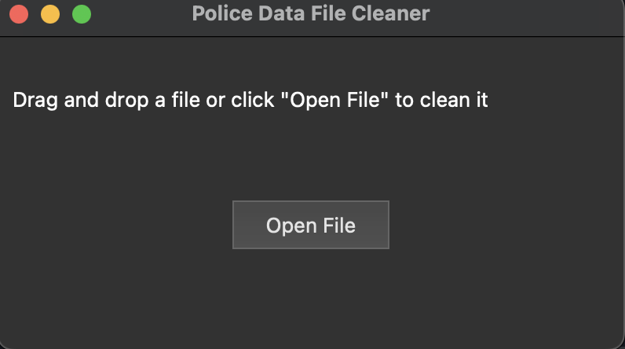

# Berwyn Capstone Project Walkthrough

## Project Overview

### Team Members:

Team Lead - David Mahon

Technical Writer - Mohamed Ndaloma

Researcher - Matthew Nanas

Technical Specialist - Adam Rodriguez

Technical Specialist - Jimin Yoon

### Project Description

Title: Town of Berwyn Heights Policing Assessment and Mapping

High Level overview:

The police department of Berwyn Heights wants more organization and understanding of the crime that occurs in the town.

To solve this, our group analyzed two crime datasets given to us by the Berwyn Heights Police Department and created a visualization of the data on a map.

The goal of this deliverable is to inform decision-makers on important issues involving the town agenda and crime.

# Usage

## **Initialize a python virtual environment**

Do this in command line in your directory before running the cleaning script:

```
python3 -m venv venv
source ./venv/bin/activate  # On macOS/Linux
.\venv\Scripts\activate   # On Windows
pip install -r src/requirements.txt
```

## When you make changes do this workflow:

1. Activate Virtual Environment:

```
source .venv/bin/activate  # On macOS/Linux
.\venv\Scripts\activate   # On Windows
```

2. Generate requirements.txt:

```
pip freeze > requirements.txt
```

3. Check the requirements.txt File:
   Open the requirements.txt file to ensure it contains the list of installed packages and their versions.

## When you are done with making changes disconnect from venv

```
deactivate
```

## End-to-End Workflow

### Cleaning Data

Run the GUI script to open the cleaning tool window through the following:

```bash
python src/GUI_Script.py
```

A window like the following will render:



Select **Open File** and navigate towards the unclean Excel spreadsheet. It will take a moment before logging a popup saying that the data was cleaned. You can then continue to import this into ArcGIS online.
